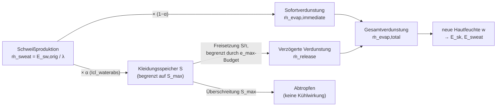

# JOS-3p1 – Die Physik hinter dem Modell

Dieses Dokument erklärt die physikalisch-physiologischen Grundlagen von JOS-3p1: welche Rechnungen aus dem
offiziellen [JOS-3-Modell](https://github.com/TanabeLab/JOS-3) (Takahashi et al., 2021, *Building and
Environment*, "Thermoregulation Model JOS-3 for Predicting Human Thermal Physiological Responses under
Diverse Environments") übernommen wurden, und was dieser Fork an Physik hinzufügt: ein erweitertes
Bekleidungsmodell mit Schweißspeicher, das Zhang-Thermalkomfortmodell und die PAR-Schätzung aus
Bewegungsdaten in der WebApp.

Anders als das Audit-Dokument (`doc/2026-08-07_audit.md`) geht es hier nicht um Code-Korrektheit, sondern um
die **fachliche Herleitung**: welche Größe bedeutet was, warum sieht die Formel so aus, und wie hängen die
Bausteine zusammen. Formelzeichen folgen, wo möglich, der Namensgebung im Quellcode.

---

## Inhalt

1. [Grundlagen: das JOS-3-Wärmehaushaltsmodell](#1-grundlagen-das-jos-3-wärmehaushaltsmodell)
2. [Erweiterung: das Bekleidungsmodell](#2-erweiterung-das-bekleidungsmodell)
3. [Erweiterung: thermische Empfindung und Komfort nach Zhang et al.](#3-erweiterung-thermische-empfindung-und-komfort-nach-zhang-et-al)
4. [WebApp: von Bewegungsdaten zur Belastungsbewertung](#4-webapp-von-bewegungsdaten-zur-belastungsbewertung)
5. [Symbolverzeichnis](#5-symbolverzeichnis)
6. [Literatur](#6-literatur)

---

## 1. Grundlagen: das JOS-3-Wärmehaushaltsmodell

*(Original JOS-3 – Quelle für diesen Abschnitt: `src/jos3/thermoregulation.py`, `construction.py`,
`matrix.py`, unverändert gegenüber dem offiziellen Repository.)*

### 1.1 Körpermodell

JOS-3 teilt den Körper in **17 Segmente** (Kopf, Hals, Brust, Rücken, Becken, je linker/rechter Ober-/
Unterarm, Hand, Ober-/Unterschenkel, Fuß). Jedes Segment besteht aus bis zu vier Gewebeschichten – Kern
(*Core*), Muskel, Fett, Haut – plus bei einigen Segmenten einer oberflächlichen Vene; dazu kommt ein
zentraler Blutpool. Das ergibt ein Netz von 85 thermischen Knoten, die über

- **Wärmeleitung** zwischen benachbarten Gewebeschichten,
- **konvektiven Wärmetransport durch den Blutfluss** (arteriell → Gewebe → venös → zentraler Pool),
- **Stoffwechselwärme** in jedem Knoten, und
- an der Haut zusätzlich **Wärmeaustausch mit der Umgebung**

gekoppelt sind. Für jeden Knoten $i$ gilt die Energiebilanz

$$
C_i \frac{dT_i}{dt} = \dot{Q}_{\text{metab},i} + \dot{Q}_{\text{blood},i} + \dot{Q}_{\text{cond},i} - \dot{Q}_{\text{env},i}
$$

mit der Wärmekapazität $C_i$ [J/K] des Knotens, der Stoffwechselwärme $\dot Q_{\text{metab},i}$ (Grundumsatz
+ Arbeit + Kältezittern + zitterfreie Thermogenese, siehe §1.7), dem Wärmestrom über den Blutfluss
$\dot Q_{\text{blood},i}$, der Wärmeleitung zu Nachbarknoten $\dot Q_{\text{cond},i}$ und – nur an den
Hautknoten – dem Wärmeverlust an die Umgebung $\dot Q_{\text{env},i}$ (sensibel + latent, §1.3–§1.5). JOS-3
löst dieses gekoppelte Gleichungssystem pro Zeitschritt implizit als lineares Matrixproblem
($\mathbf{T}_{t+\Delta t} = \mathbf{A}^{-1}(\mathbf{B}\,\mathbf{T}_o + \mathbf{Q}\,\Delta t/\mathbf{C} + \mathbf{T}_t)$,
`jos3.py`, `_run()`). Alle Erweiterungen dieses Forks greifen ausschließlich in die Berechnung von
$\dot Q_{\text{env},i}$ ein – die Knotenstruktur und die Blutfluss-/Stoffwechselmodelle bleiben unangetastet.

### 1.2 Wärmeübergang Haut ↔ Umgebung

Der Wärmeaustausch der Haut mit der Umgebung läuft über zwei parallele Pfade: **Konvektion** (Koeffizient
$h_c$) und **Strahlung** (Koeffizient $h_r$). Beide sind empirische, posturabhängige Korrelationen
(Ichihara et al. 1997 für Stehen/Sitzen, Kurazumi et al. 2008 für Liegen; `conv_coef()`, `rad_coef()`).
Daraus ergibt sich die **operative Temperatur**

$$
T_o = \frac{h_c\, T_a + h_r\, T_r}{h_c + h_r}
$$

— die gedachte Temperatur einer Umgebung mit gleicher Strahlungs- wie Lufttemperatur, die denselben
Wärmestrom erzeugen würde wie die tatsächliche Kombination aus Lufttemperatur $T_a$ und mittlerer
Strahlungstemperatur $T_r$.

### 1.3 Trockener Wärmewiderstand (sensible Wärme)

Bekleidung wird als zusätzlicher Widerstand in Reihe zum Luftgrenzschicht-Widerstand modelliert
(`dry_r()`):

$$
R_t = \frac{R_a}{f_{cl}} + R_{cl}, \qquad R_a = \frac{1}{h_{cc} + h_r}, \qquad R_{cl} = 0{,}155\, I_{cl}
$$

$I_{cl}$ ist die Bekleidungsisolation in `clo` (1 clo = 0,155 m²K/W), $f_{cl}$ der Bekleidungsflächenfaktor
$f_{cl} = 1 + 0{,}2\,I_{cl}$ (bzw. $1{,}05+0{,}1\,I_{cl}$ ab 0,5 clo) und $h_{cc}=h_c\cdot(p_t/101{,}33)^{0{,}55}$
die höhenkorrigierte Konvektion. Der sensible Wärmeverlust ist dann

$$
\dot Q_{\text{sens}} = \frac{T_{sk} - T_o}{R_t}\, A_{Du}
$$

mit der DuBois-Körperoberfläche $A_{Du}$ (oder einer der drei alternativen BSA-Formeln).

### 1.4 Feuchter Wärmewiderstand (Verdunstung)

Analog dazu der Verdunstungswiderstand (`wet_r()`), über die **Lewis-Beziehung** ($LR=16{,}5$ K/kPa, koppelt
konvektiven Wärme- und Stoffübergang) mit dem trockenen Pfad verknüpft:

$$
R_{et} = \frac{R_{ea}}{f_{cl}} + R_{ecl}, \qquad R_{ea} = \frac{1}{h_c\cdot LR\cdot(101{,}33/p_t)^{0{,}45}}, \qquad R_{ecl} = \frac{R_{cl}}{LR \cdot i_{cl,o}}
$$

mit demselben höhenabhängigen Umgebungsdruck $p_t$ [kPa] wie in §1.3 – bei Standardluftdruck
($p_t=101{,}33$ kPa) verschwindet der Korrekturterm; auf einem Berggipfel mit niedrigerem $p_t$ steigt
$R_{ea}$ dagegen an (geringere Luftdichte, geringere Verdunstungskühlung bei gleichem $h_c$).

$i_{cl,o}$ ist der **Dampfdurchlässigkeitsindex** der Kleidung (Standardwert 0,45 für normale Textilien –
0 = wasserdicht, 1 = keine Behinderung des Dampftransports).

### 1.5 Verdunstung und Schwitzen

Die maximal mögliche Verdunstungskühlung ergibt sich aus dem Dampfdruckgefälle Haut → Umgebung, über die
**Antoine-Gleichung** für den Sättigungsdampfdruck:

$$
p_{sk,s} = \exp\!\left(16{,}6536 - \frac{4030{,}183}{T_{sk}+235}\right), \qquad
E_{max} = \frac{p_{sk,s} - p_a}{R_{et}}\, A_{Du}, \qquad p_a = p_{sk,s}(T_a)\cdot \frac{RH}{100}
$$

Ein zentrales Regelsignal (proportional zu Kern- und Hautabweichungen vom Sollwert, §1.6) steuert die
tatsächliche Schweißproduktion $E_{sw}$ je Segment. Die daraus resultierende **Hautfeuchte** (skin
wettedness) ist

$$
w = 0{,}06 + 0{,}94\, \frac{E_{sw}}{E_{max}}, \qquad w \le 1
$$

Die Konstante 0,06 steht für die insensible (diffuse) Feuchtabgabe durch die Haut, die auch ohne aktives
Schwitzen stattfindet; die tatsächliche Verdunstungskühlung ist $E_{sk} = w\cdot E_{max}$. **An genau
dieser Formel setzt die Wasseraufnahme-Erweiterung dieses Forks an (§2.3).**

### 1.6 Sollwertregelung

Zu Simulationsbeginn führt JOS-3 in einer PMV = 0 - Umgebung eine mehrstündige Gleichgewichtsrechnung durch
(`_reset_setpt()`) und speichert die sich dabei einstellenden Kern- und Hauttemperaturen je Segment als
Sollwerte $T_{cr,i}^{set}$, $T_{sk,i}^{set}$ (33,9–35,8 °C, segmentabhängig – **kein** einheitlicher Wert).
Alle Regelsignale (Schwitzen, Hautdurchblutung, Zittern) basieren auf den Abweichungen
$\varepsilon_{cr,i}=T_{cr,i}-T_{cr,i}^{set}$, $\varepsilon_{sk,i}=T_{sk,i}-T_{sk,i}^{set}$. Diese
segmentweisen Sollwerte sind auch der "neutrale Referenzpunkt", den das Zhang-Komfortmodell (§3) benötigt.

### 1.7 Stoffwechsel und PAR

Der Grundumsatz (Basal Metabolic Rate, BMR) wird über Harris-Benedict- oder Ganpule-Regressionen aus
Körpergröße, -gewicht, Alter und Geschlecht geschätzt (`basal_met()`) und auf die 17 Segmente verteilt
(`local_mbase()`). Zusätzliche Arbeit wird über den **Physical Activity Ratio** (PAR) eingerechnet:

$$
\dot Q_{\text{work}} = (\text{PAR}-1)\cdot \text{BMR}
$$

PAR ist damit ein **Vielfaches des Grundumsatzes** – nicht von MET (1 MET = 58,15 W/m², der Ruheumsatz im
Sitzen, per Definition höher als der Grundumsatz). Diese Unterscheidung ist die Grundlage der
PAR-Schätzung in der WebApp (§4.1).

---

## 2. Erweiterung: das Bekleidungsmodell

*(Erweiterung in diesem Fork – Quelle: `src/jos3/jos3.py`.)*

Das Original-JOS-3 kennt nur zwei Kleidungsparameter: $I_{cl}$ (Isolation, §1.3) und den intern fixen
Dampfdurchlässigkeitsindex $i_{cl,o}=0{,}45$ (§1.4). Dieser Fork macht daraus **fünf unabhängig
einstellbare, segmentweise Eigenschaften**, die reale Textilunterschiede abbilden:

| Symbol (Code) | Bedeutung | physikalische Analogie |
|---|---|---|
| $\varepsilon_{cl}$ (`Icl_emissivity`) | Emissionsgrad | reflektierende vs. schwarze Oberfläche |
| $\pi_{cl}$ (`Icl_airperm`) | Luftdurchlässigkeit | winddicht vs. netzartig |
| $i_{cl,o}$ (`Icl_evap_eff`) | Dampfdurchlässigkeit | wasserdicht vs. atmungsaktiv |
| $\alpha$ (`Icl_waterabs`) | Schweißaufnahme-Anteil | Baumwolle (hoch) vs. Funktionsfaser (niedrig) |
| $\tau$ (`release_tau`), $S_{max}$ (`max_storage`) | Trocknungsdynamik | Trocknungszeit, Saugfähigkeit |

### 2.1 Strahlung und Konvektion

Emissionsgrad und Luftdurchlässigkeit skalieren die beiden Wärmeübergangskoeffizienten aus §1.2/§1.3
**multiplikativ**, bevor operative Temperatur und trockener Widerstand berechnet werden:

$$
h_c' = h_c \cdot \pi_{cl}, \qquad h_r' = h_r \cdot \varepsilon_{cl}
$$

$$
T_o = \frac{h_c' T_a + h_r' T_r}{h_c' + h_r'}, \qquad R_t = \frac{1/(h_c'\!\cdot\!(p_t/101{,}33)^{0{,}55} + h_r')}{f_{cl}} + R_{cl}
$$

Physikalisch: eine winddichte Jacke ($\pi_{cl}\to 0$) dämpft den konvektiven Wärmeverlust, eine
reflektierende Rettungsdecke ($\varepsilon_{cl}\to 0$) den Strahlungsverlust. Beide Werte sind nach unten
auf $\varepsilon_{\min}=10^{-3}$ begrenzt (nicht exakt 0), damit $h_c'+h_r'$ nicht verschwindet.

**Bewusste Modellentscheidung:** Der Verdunstungswiderstand $R_{et}$ (§1.4) verwendet weiterhin das
**unskalierte** $h_c$ – Windschutz wirkt nur auf den trockenen Pfad, der Dampftransport wird unabhängig
davon durch $i_{cl,o}$ (§2.2) bestimmt. Das folgt der in der Bekleidungsphysiologie üblichen Trennung
zwischen der (windabhängigen) Isolation und dem (stoffabhängigen) Dampfdurchlässigkeitsindex $i_m$ (vgl.
ISO 9920).

### 2.2 Dampfdurchlässigkeit

`Icl_evap_eff` ist ein direkter, öffentlich einstellbarer Zugriff auf $i_{cl,o}$ aus §1.4 (Standard weiter
0,45) – keine neue Formel, nur ein zuvor internes Modellelement wird zugänglich gemacht.

### 2.3 Schweißaufnahme und verzögerte Verdunstung

Das ist der physikalisch umfangreichste Baustein dieses Forks: Schweiß verdunstet in der Realität nicht
zwangsläufig sofort an der Haut – ein Teil wird von der Kleidung aufgesogen, dort zwischengespeichert und
verzögert wieder an die Umgebung abgegeben. Genau das bildet dieses Modell nach, mit $\lambda = 2418$ J/g
als latenter Verdampfungswärme von Schweiß (derselbe Wert, den JOS-3 bereits intern verwendet).

**Schritt für Schritt** (alle Größen je Segment, Zeitschritt $\Delta t$):

1. **Produzierte Schweißmasse** – die vom Regelsignal vorgegebene Verdunstungsleistung $E_{sw}^{orig}$
   (§1.5, vor jeder Speicher-Anpassung) wird über die latente Wärme in eine Masse umgerechnet:
   $$
   \dot m_{sweat} = \frac{E_{sw}^{orig}}{\lambda}, \qquad m_{sweat} = \dot m_{sweat}\cdot \Delta t
   $$
2. **Aufteilung** in einen von der Kleidung aufgenommenen und einen sofort verdunstenden Anteil:
   $$
   m_{abs} = \alpha\, m_{sweat}, \qquad m_{evap}^{imm} = (1-\alpha)\, m_{sweat}
   $$
3. **Speicherstand** aktualisieren, begrenzt durch die Kapazität $S_{max}$ (überschüssiges Wasser tropft
   ohne Kühlwirkung ab – dieser Massenverlust ist bereits über Schritt 1 als Körpergewichtsverlust erfasst,
   siehe §2.3.1):
   $$
   S \leftarrow \min(S + m_{abs},\; S_{max})
   $$
4. **Verdunstungsbudget** aus der Umgebungsbedingung: wie viel Masse könnte laut Dampfdruckgefälle
   $E_{max}$ (§1.5) in diesem Schritt überhaupt verdunsten?
   $$
   m_{max} = \frac{E_{max}}{\lambda}\,\Delta t, \qquad m_{rest} = \max(m_{max} - m_{evap}^{imm},\, 0)
   $$
   Dieses Budget verhindert, dass in gesättigter Luft ($E_{max}\approx 0$) gespeichertes Wasser
   "unsichtbar" verschwindet, ohne die entsprechende Kühlwirkung in der Energiebilanz zu erzeugen.
5. **Freisetzung** aus dem Speicher – exponentieller Abklingansatz mit Zeitkonstante $\tau$, als
   Euler-Schritt diskretisiert und durch Speicherstand *und* Budget gedeckelt:
   $$
   m_{rel} = \min\!\left(\frac{S}{\tau}\,\Delta t,\; S,\; m_{rest}\right), \qquad S \leftarrow S - m_{rel}
   $$
6. **Neue Hautfeuchte**, mit derselben Formstruktur wie in §1.5, aber gespeist aus der tatsächlich in
   diesem Schritt verdunsteten Gesamtmasse statt aus dem reinen Regelsignal:
   $$
   \dot m_{evap}^{tot} = \frac{m_{evap}^{imm}+m_{rel}}{\Delta t}, \qquad
   E_{evap} = \dot m_{evap}^{tot}\cdot\lambda, \qquad
   w = \operatorname{clip}\!\left(0{,}06 + 0{,}94\,\frac{E_{evap}}{E_{max}},\, 0,\, 1\right)
   $$
   $E_{sk}=w\cdot E_{max}$ geht direkt in die Energiebilanz der Haut ein (§1.1).

#### 2.3.1 Körpergewichtsverlust bleibt unabhängig vom Speicher

Der von JOS-3 ausgegebene Gewichtsverlust ($Wle$) verwendet bewusst weiter $E_{sw}^{orig}$ (Schritt 1),
**nicht** die speicherangepasste Verdunstung aus Schritt 6:

$$
\dot m_{Wle,sk} = \frac{E_{sw}^{orig} + 0{,}06\, E_{max}}{\lambda}
$$

Sobald Schweiß die Haut verlässt – ob er sofort verdunstet, in der Kleidung zwischengespeichert wird oder
abtropft – zählt er als Körpermasseverlust. Die WebApp berücksichtigt zusätzlich, dass noch in der Kleidung
gespeichertes (nicht verdunstetes) Wasser das Körper+Kleidungs-System als Ganzes noch nicht verlassen hat
(§4.2).

#### 2.3.2 Grenzfall $\alpha=0$: exakte Rückwärtskompatibilität

Für $I_{cl,waterabs}=0$ (Standardeinstellung) ist $m_{evap}^{imm}=m_{sweat}$, der Speicher bleibt leer, und
$E_{evap}=E_{sw}^{orig}$ – die neue Hautfeuchte-Formel in Schritt 6 ist dann **rechnerisch identisch** mit
der Original-Formel aus §1.5. Das Wasseraufnahme-Modell ist bei Default-Einstellung ein reines No-Op.

---

## 3. Erweiterung: thermische Empfindung und Komfort nach Zhang et al.

*(Erweiterung in diesem Fork – Quelle: `src/jos3/comfort_zhang.py`.)*

### 3.1 Warum ein zusätzliches Modell?

JOS-3 berechnet Physiologie (Temperaturen, Durchblutung, Schwitzen), aber keine subjektive Bewertung. Das
im Original mitgelieferte `comfmod.pmv()` dient nur der Initialisierung und ist ohnehin ungeeignet: **PMV**
(Predicted Mean Vote, Fanger 1972) ist ein stationäres, uniformes Ganzkörpermodell, validiert für
1–4 MET – für eine Bergwanderung mit stark asymmetrischer, transienter Belastung (PAR bis 15, einzelne
Körperteile schwitzend, andere auskühlend) ungeeignet.

Das Modell von **Zhang, Arens, Huizenga & Han** (2010, *Building and Environment* 45, drei Teile) wurde
genau für diesen Fall entwickelt: segmentweise, transient, aus Chamber-Tests mit gezielter lokaler
Kühlung/Erwärmung einzelner Körperteile abgeleitet. Es nutzt exakt die Größen, die JOS-3 bereits liefert:
lokale Hauttemperatur $T_{sk,i}$ und die in §1.6 beschriebenen segmentweisen Sollwerte $T_{sk,i}^{set}$.

Beide Skalen laufen von $-4$ (sehr kalt / sehr unangenehm) bis $+4$ (sehr heiß / sehr angenehm), 0 = neutral.

### 3.2 Teil I – Lokale thermische Empfindung

Die Empfindung eines Körperteils setzt sich aus einem **statischen** (stationären) und einem
**dynamischen** (transienten) Anteil zusammen:

$$
S_{local,i} = S_{static,i} + S_{dynamic,i}
$$

**Statischer Anteil** – eine logistische Funktion der Abweichung vom Sollwert, moduliert durch den
Ganzkörperzustand:

$$
S_{static,i} = 4\left(\frac{2}{1+\exp\!\big[-(C_1\,\Delta_i + K_1(\Delta_i-\bar\Delta))\big]} - 1\right)
$$

mit $\Delta_i = T_{sk,i}-T_{sk,i}^{set}$ (lokale Abweichung) und $\bar\Delta = \bar T_{sk}-\bar T_{sk}^{set}$
(mittlere Abweichung über den ganzen Körper, gewichtet mit den relativen Körperoberflächenanteilen). Der
$K_1$-Term ist der Kern der Zhang-Erkenntnis: **dieselbe** lokale Hauttemperatur fühlt sich kälter an, wenn
der Rest des Körpers warm ist, und wärmer, wenn der Rest kalt ist. $C_1$ und $K_1$ sind je Körperteil und
je nach Vorzeichen von $\Delta_i$ (Abkühlung vs. Erwärmung) unterschiedlich:

| Körperteil | $C_1$ (kalt) | $K_1$ (kalt) | $C_1$ (warm) | $K_1$ (warm) |
|---|---|---|---|---|
| Kopf | 0,40 | 0,20 | 3,90 | 0,20 |
| Nacken | 0,40 | 0,15 | 1,25 | 0,15 |
| Brust | 0,35 | 0,10 | 1,00 | 0,10 |
| Rücken | 0,30 | 0,10 | 1,00 | 0,10 |
| Becken | 0,20 | 0,15 | 0,40 | 0,15 |
| Oberarm | 0,30 | 0,10 | 0,40 | 0,10 |
| Unterarm | 0,30 | 0,10 | 0,70 | 0,10 |
| Hand | 0,20 | 0,15 | 0,45 | 0,15 |
| Oberschenkel | 0,20 | 0,10 | 0,30 | 0,10 |
| Unterschenkel | 0,30 | 0,10 | 0,40 | 0,10 |
| Fuß | 0,25 | 0,15 | 0,25 | 0,15 |

**Dynamischer Anteil** – Thermorezeptoren reagieren stärker auf *Änderungsraten* als auf Absolutwerte
("Overshoot"-Effekt): eine fallende Hauttemperatur fühlt sich kälter an als dieselbe Temperatur im
Gleichgewicht.

$$
S_{dynamic,i} = C_{21,i}\min\!\left(\frac{dT_{sk,i}}{dt},0\right) + C_{22,i}\max\!\left(\frac{dT_{sk,i}}{dt},0\right) + C_{3,i}\,\frac{dT_{core}}{dt}
$$

Der $C_3$-Term (Kernvorschub) ist nur an Brust, Rücken und Becken ungleich null – dort löst lokale Kühlung
in den Chamber-Tests einen sofortigen Kernanstieg aus, den das Modell als zusätzliches Kältesignal
interpretiert. **Diese Kausalität kehrt sich unter Belastung um** (Kern steigt durch Muskelwärme, nicht
durch Kühlung), weshalb dieser Fork den $C_3$-Term standardmäßig deaktiviert
(`USE_CORE_DERIVATIVE=False`) – ein Bergwanderer mit steigender Kerntemperatur soll nicht als "kühl
empfindend" fehlinterpretiert werden.

### 3.3 Teil II – Lokaler thermischer Komfort

Komfort ist **nicht** einfach der Kehrwert der Empfindung: ein kühler Fuß ist unangenehm, wenn der übrige
Körper kalt ist, aber angenehm, wenn der übrige Körper überhitzt ist ("Alliesthesia"-Effekt, Cabanac 1971).
Das Modell bildet eine **sattelförmige Kurve**, deren Maximum (Höhe *und* Lage) vom
Ganzkörper-Empfindungszustand $S_{overall}$ abhängt:

$$
C_{local,i} = \operatorname{clip}\!\Big(\text{mix}\cdot |u|^{n} + w,\; -4,\, 4\Big)
$$

mit

$$
w = C_6 + C_{71}|S_{overall}^-| + C_{72}\,S_{overall}^+ \quad\text{(maximal erreichbarer Komfort)}
$$
$$
x = C_{31}|S_{overall}^-| + C_{32}\,S_{overall}^+ + C_8 \quad\text{(Verschiebung des Maximums)}, \qquad u = S_{local,i}+x
$$
$$
\text{mix} = \frac{a-b}{1+e^{25u}} + b, \qquad a = \frac{-4-w}{|-4+x|^{n}}, \qquad b = \frac{-4-w}{|4+x|^{n}}
$$

($S_{overall}^- = |\min(S_{overall},0)|$, $S_{overall}^+ = \max(S_{overall},0)$.) Der Exponent $n\in\{1;
1{,}5; 2\}$ steuert die Krümmung (linear, exponentiell, quadratisch) und ist je Körperteil aus den
Originaldaten bestimmt. Zwei Eigenschaften legen die Kurve eindeutig fest und wurden numerisch
nachgeprüft: bei neutralem Ganzkörperzustand liegt das Maximum exakt bei $C_6$, und an den Rändern
$S_{local}=\pm4$ ist der Komfort exakt $-4$.

| Körperteil | $C_{31}$ | $C_{32}$ | $C_6$ | $C_{71}$ | $C_{72}$ | $C_8$ | $n$ |
|---|---|---|---|---|---|---|---|
| Kopf | −0,35 | 0,35 | 2,17 | 0,28 | 0,40 | 0,50 | 2,0 |
| Nacken | 0,00 | 0,00 | 1,96 | 0,00 | 0,00 | −0,19 | 1,0 |
| Rücken | −0,45 | 0,45 | 2,10 | 0,96 | 0,00 | 0,00 | 1,0 |
| Brust | −0,66 | 0,66 | 2,10 | 1,39 | 0,90 | 0,00 | 2,0 |
| Becken | −0,59 | 0,00 | 2,06 | 0,50 | 0,00 | −0,51 | 1,0 |
| Oberarm | −0,30 | 0,35 | 2,14 | 0,00 | 0,00 | −0,40 | 1,0 |
| Unterarm | −0,23 | 0,23 | 2,00 | 0,00 | 1,71 | −0,68 | 1,0 |
| Hand | −0,80 | 0,80 | 1,98 | 0,48 | 0,48 | 0,00 | 1,0 |
| Oberschenkel | 0,00 | 0,00 | 1,98 | 0,00 | 0,00 | 0,00 | 1,0 |
| Unterschenkel | −0,20 | 0,61 | 2,00 | 1,67 | 0,00 | 0,00 | 1,5 |
| Fuß | −0,91 | 0,40 | 2,13 | 0,50 | 0,30 | 0,00 | 2,0 |

### 3.4 Teil III – Ganzkörperempfindung

Die 17 lokalen Empfindungswerte werden zu **einer** Zahl zusammengeführt, in drei Stufen:

**1. Gruppierung.** Körperteile mit $S_{local}>0$ bzw. $<0$ bilden zwei Gruppen; die größere (bei
Gleichstand: die warme) bestimmt die Grundrichtung. Ein Körperteil zählt als "gegenläufig", wenn
$|S_{local}|>1$ – bei den drei **dominanten** Körperteilen (Brust, Rücken, Becken) genügt beim Abkühlen
bereits $S_{local}\le -1$: der Rumpf reagiert empfindlicher auf Kühlung als auf Erwärmung.

**2. Empfindung der größeren Gruppe** ("no-opposite"-Modell): bei extremen Werten ($\ge 3$ Körperteile,
drittextremster Wert jenseits $\pm2$) ein gewichteter Mittelwert aus dem extremsten und drittextremsten
Wert –

$$
S_{overall} = 0{,}5\,S_{max} + 0{,}5\,S_{3.\,max} \quad(\text{warme Seite}), \qquad
S_{overall} = 0{,}38\,S_{min} + 0{,}62\,S_{3.\,min} \quad(\text{kalte Seite})
$$

– nahe Neutral geht das Modell graduell in den einfachen Mittelwert über größer werdende Teilmengen der
Werte über.

**3. Einfluss gegenläufiger Körperteile.** Kühlt einer der drei dominanten Körperteile spürbar ab, während
der Rest warm ist, **dominiert dieser Wert die Gesamtempfindung vollständig** – der kälteste dominante Wert
wird direkt zur Gesamtempfindung:

$$
S_{overall} = \min\big(S_{local,\text{Brust}},\,S_{local,\text{Rücken}},\,S_{local,\text{Becken}}\big)
$$

(nur unter den tatsächlich gegenläufigen dominanten Teilen). In allen anderen Fällen wird eine
**Individualkraft** je gegenläufigem Körperteil berechnet – ein dreiteiliger linearer Regressionsansatz:

$$
F_i = a(\Delta S_{local,i} - c) + b
$$

mit körperteilspezifischen $(a,b,c)$, unterschiedlich für starke Abkühlung ($\Delta S\le -2$), moderate
Änderung ($-2<\Delta S<2$) und starke Erwärmung ($\Delta S\ge 2$). Die stärkste und (zu 10 %) zweitstärkste
Kraft werden addiert und der Gesamtempfindung der größeren Gruppe hinzugerechnet:

$$
S_{overall} = S_{overall}^{bigger} + F_{(1)} + 0{,}1\, F_{(2)}
$$

> **Hinweis zur Koeffiziententabelle:** Für die Erwärmungs-Spalte ($\Delta S_{local}\ge 2$) widerspricht die
> im Originalpaper gedruckte Tabelle den eigenen Abbildungsbeschriftungen des Papers (z. B. Brust: gedruckt
> $a=0{,}40$, Abbildung "$0{,}97\cdot\Delta S$"). Für Brust und Hand wurde das durch pixelgenaue Vermessung
> der geplotteten Regressionsgeraden unabhängig bestätigt (gemessene Steigung 0,968 bzw. 0,333). Dieser Fork
> verwendet daher für Kopf, Brust, Rücken, Becken, Hand, Ober- und Unterschenkel die aus den
> Abbildungen/dem Flussdiagramm bestätigten Werte; Details siehe Kommentar über `OPPOSITE_FORCE` in
> `comfort_zhang.py`.

### 3.5 Teil III – Ganzkörperkomfort

Deutlich einfacher als die Empfindung: Ganzkörperkomfort wird von den **schlechtesten** lokalen
Komfortwerten dominiert ("complaint-driven"):

$$
C_{overall} = \frac{1}{n}\sum \big(\text{die } n \text{ schlechtesten lokalen Werte}\big)
$$

mit $n=2$ unter stabilen, unkontrollierten Bedingungen (Regel 1) und $n=3$ – unter Einbeziehung des
**besten** lokalen Werts – wenn die Bedingungen transient sind oder die Person Kontrolle über die eigene
Umgebung hat (Regel 2, Default in diesem Fork, da beides auf eine Bergwanderung zutrifft: wechselnde
Bedingungen und z. B. die Möglichkeit, Kleidung anzupassen). Zwei kalte Hände bzw. Füße zählen dabei als
ein Komplaint, nicht als zwei.

---

## 4. WebApp: von Bewegungsdaten zur Belastungsbewertung

*(Erweiterung in diesem Fork – Quelle: `webapp/frontend/src/lib/`.)*

### 4.1 PAR-Schätzung aus Gehdaten

Die WebApp erlaubt die Eingabe von Geschwindigkeit, Steigung, Zuladung und Geländetyp statt eines direkten
PAR-Werts. Da PAR ein Vielfaches des *Grundumsatzes* ist (§1.7), nicht von MET, wird der Stoffwechselumsatz
zunächst in **absoluten Watt** berechnet und erst am Ende durch den individuellen Grundumsatz geteilt.

Grundlage der Gehkosten ist die empirische Formel von **Minetti et al. (2002)**, ein Polynom 5. Grades über
die Steigung $i$ (Bruchteil, positiv bergauf), gültig von $-45\,\%$ bis $+45\,\%$:

$$
C_w(i) = 280{,}5\,i^5 - 58{,}7\,i^4 - 76{,}8\,i^3 + 51{,}9\,i^2 + 19{,}6\,i + 2{,}5 \quad\left[\frac{\text{J}}{\text{kg}\cdot\text{m}}\right]
$$

Daraus, zusammen mit dem Lastzuschlag nach **Pandolf et al. (1977)**, die metabolische Gesamtleistung:

$$
\dot W = \underbrace{1{,}5\, m_K}_{\text{Ruheterm (Pandolf)}} \;+\; \underbrace{\eta \cdot C_w(i)\cdot(m_K+m_L)\cdot v}_{\text{Fortbewegung}} \;+\; \underbrace{2{,}0\,(m_K+m_L)\left(\frac{m_L}{m_K}\right)^{2}}_{\text{Lastzuschlag (Pandolf)}}
$$

mit Körpermasse $m_K$, Zuladung $m_L$, Geschwindigkeit $v$ und geländeabhängigem Faktor $\eta$ (1,0 für
Asphalt bis 2,1 für Geröll, nach Soule & Goldman). Der PAR-Wert für die Simulation ist dann

$$
\text{PAR} = \frac{\dot W}{\text{BMR}\cdot A_{Du}}
$$

**Warum Minetti statt der militärisch verbreiteten Pandolf-Gehkostenformel?** Pandolfs eigener Steigungsterm
ist linear und liefert bergab unphysikalische (negative) Werte; Minetti ist durchgehend von $-45\,\%$ bis
$+45\,\%$ validiert, ohne Naht zwischen Auf- und Abstieg. Der Lastzuschlagsterm wird dennoch von Pandolf
übernommen, da Minetti unbeladenes Gehen misst und Pandolfs Term als anerkannte Korrektur gilt.

### 4.2 Belastungsbewertung

Aus den Simulationsergebnissen leitet die WebApp direkte Warnindikatoren ab, orientiert an anerkannten
Grenzwertsystematiken (ISO 7933 Hitzebelastung, ISO 11079-nahe Kälteschutz-Richtwerte für Extremitäten,
sowie arbeits-/sportphysiologische Faustregeln für Dehydration). Alle Grenzwerte sind fest verdrahtet
(`webapp/frontend/src/lib/thresholds.ts`) und aktuell nicht nutzerkonfigurierbar; es werden zwei Stufen
unterschieden – **Warnung** und **kritisch**:

| Größe | Norm | Warnung | Kritisch | Quelle / Begründung |
|---|---|---|---|---|
| Kerntemperatur $T_{cr,Chest}$ | 36,0–38,0 °C | <36,0 °C bzw. >38,0 °C | <35,0 °C bzw. >38,5 °C | ISO 7933: Dauerarbeitsgrenze 38,0 °C unakklimatisiert / 38,5 °C akklimatisiert; <36,0 °C beginnende, <35,0 °C klinische Hypothermie |
| Mittlere Hauttemperatur $\bar T_{sk}$ | 31,0–35,5 °C | <31,0 °C bzw. >35,5 °C | <30,0 °C bzw. >37,0 °C | Neutralbereich 33–35 °C (§1.6); ab ~30 °C setzt typischerweise Kältezittern ein |
| Hautfeuchte $w$ | $w<0{,}5$ | $0{,}5\le w\le0{,}85$ | $w>0{,}85$ | $w>0{,}3$ wird als feucht empfunden, $w_{max}\approx0{,}85$ ist die Verdunstungsgrenze unakklimatisierter Personen (§1.5) |
| Extremitäten-Hauttemperatur (Hand/Fuß, je Körperteil) | >20 °C | 15–20 °C | <15 °C | ISO 11079: unter 20 °C lässt die Fingerfertigkeit nach, ab 15 °C schmerzhaft, ab 10 °C Taubheitsgefühl |
| Zittern $\sum_i \dot Q_{shiv,i}$ (Ganzkörper) | 0 W | 0,1–100 W | >100 W | jedes Zittern zeigt beginnenden Kältestress an; anhaltend >100 W erhöht Glykogenverbrauch und Ermüdung spürbar |
| Dehydration $D(t)$ | <2 % | 2–4 % | >4 % | arbeits-/sportphysiologische Faustregel: ab 2 % Körpermasseverlust messbare Leistungseinbußen, ab 4 % ernstzunehmend |
| Kleidungssättigung $\sigma(t)$ | <0,7 | 0,7–0,95 | >0,95 | oberhalb ~0,95 liefert der Speicher praktisch keine Verdunstungskühlung mehr (§2.3) |

Zwei Modellentscheidungen dazu: Die Extremitäten-Grenzwerte gelten **je Körperteil** (Hand/Fuß links und
rechts einzeln geprüft) statt auf den Ganzkörper-Mittelwert – in der Kälte "binden" typischerweise die
Extremitäten, während $\bar T_{sk}$ noch unauffällig aussieht. Zittern ist bewusst als **nachlaufender**
Indikator eingeordnet: Es setzt erst ein, wenn die Haut bereits ausgekühlt ist, während die
Hauttemperatur-Schwellen das führende Signal sind – im Interface werden beide daher gemeinsam angezeigt.

- **Dehydration**, als Prozent der Körpermasse aus dem kumulierten Gewichtsverlust:
  $$
  D(t) = \frac{1}{m_K\cdot 1000}\left(\int_0^t \dot m_{Wle}(t')\,dt' \;-\; S(t)\right)\cdot 100\,\%
  $$
  Hier wird das aktuell noch **in der Kleidung gespeicherte** Wasser $S(t)$ (§2.3) von der kumulierten
  Menge abgezogen: Es hat den Körper *und* die Kleidung als System noch nicht verlassen, zählt also erst
  nach tatsächlicher Verdunstung als echter Flüssigkeitsverlust.
- **Kleidungssättigung**, als Füllstand des Wasserspeichers relativ zu seiner Kapazität:
  $$
  \sigma(t) = \frac{S(t)}{S_{max}} \in [0,1]
  $$
  Ein gesättigtes Kleidungsstück ($\sigma\to1$) liefert keine Verdunstungskühlung mehr und wird bei der
  nächsten Pause zur Kältelast (nasse, nicht mehr trocknende Kleidung).

### 4.3 Visualisierung

Die Körper-Heatmap färbt jede Region nach dem gewählten Wert. Zwei Rampen kommen zum Einsatz: eine
**sequenzielle**, mehrfarbige Rampe (blau → cyan → grün → gelb → orange → rot, in OKLCH statt sRGB
interpoliert, um die "matschigen" Helligkeitseinbrüche klassischer Jet-Farbverläufe zu vermeiden) für
Größen ohne bedeutungstragenden Nullpunkt (Temperaturen, Sättigung), und eine **divergierende**
Blau-Rot-Rampe für Größen mit bedeutungstragendem Nullpunkt (Hautfeuchte-Abweichung, Zhang-Empfindung/
-Komfort) – hier codiert die Farbe Abweichung *und* Richtung vom neutralen Mittelpunkt. Beide Rampen
skalieren relativ zum Wertebereich der jeweils angezeigten Zeitschritte, nicht zu den festen Grenzwerten
aus §4.2 – die Heatmap beantwortet "wo im Körper ist es warm/kalt", nicht "ist das schon kritisch".

Die Grenzwerte aus §4.2 erscheinen stattdessen an zwei Stellen: als halbtransparente Gelb-/Rot-Bänder
hinter den betroffenen Zeitreihen-Diagrammen (Kerntemperatur, mittlere Hauttemperatur, Hautfeuchte,
Kleidungssättigung, Dehydration – jeweils von der Warnungs- bzw. Kritisch-Grenze bis zum Achsenrand
schraffiert) und als Textliste jeder im Simulationslauf überschrittenen Grenze, inklusive Zeitpunkt und
zugehörigem Zeitplan-Abschnitt. Die beiden Extremitäten- und Zittern-Grenzwerte fließen nur in die
Textliste ein, da sie je Körperteil bzw. summiert über alle Segmente ausgewertet werden und sich nicht
sinnvoll einem einzelnen Zeitreihen-Diagramm zuordnen lassen. Das Zhang-Komfortpanel (§3) erhält bewusst
**keine** Bänder: Empfindung/Komfort sind ein Kontinuum ohne physiologische Gefahrengrenze, anders als die
strain-Größen dieses Abschnitts.

---

## 5. Symbolverzeichnis

| Symbol | Bedeutung | Einheit |
|---|---|---|
| $T_a$, $T_r$, $T_o$ | Luft-, Strahlungs-, operative Temperatur | °C |
| $T_{sk,i}$, $T_{cr,i}$ | Haut-/Kerntemperatur Segment $i$ | °C |
| $T_{sk,i}^{set}$, $T_{cr,i}^{set}$ | zugehörige Sollwerte (§1.6) | °C |
| $h_c$, $h_r$ | konvektiver/radiativer Wärmeübergangskoeffizient | W/(m²K) |
| $I_{cl}$ | Bekleidungsisolation | clo |
| $i_{cl,o}$ | Dampfdurchlässigkeitsindex der Kleidung | – |
| $\varepsilon_{cl}$, $\pi_{cl}$ | Emissionsgrad, Luftdurchlässigkeit der Kleidung (Fork) | – |
| $\alpha$ | Schweißaufnahme-Anteil der Kleidung (Fork) | – |
| $S$, $S_{max}$ | Wasserspeicher der Kleidung, Kapazität (Fork) | g |
| $\tau$ | Trocknungszeitkonstante (Fork) | s |
| $R_t$, $R_{et}$ | trockener/feuchter Wärmewiderstand | m²K/W, m²kPa/W |
| $E_{max}$, $E_{sw}$, $E_{sk}$ | max./tatsächliche Schweiß-/Hautverdunstung | W |
| $w$ | Hautfeuchte (skin wettedness) | – |
| $\lambda$ | latente Verdampfungswärme von Schweiß (2418) | J/g |
| $A_{Du}$ | Körperoberfläche (DuBois) | m² |
| PAR | Physical Activity Ratio (Vielfaches des Grundumsatzes) | – |
| BMR | Grundumsatz | W/m² |
| $S_{local,i}$, $C_{local,i}$ | lokale Zhang-Empfindung/-Komfort, Körperteil $i$ | −4…+4 |
| $S_{overall}$, $C_{overall}$ | Ganzkörper-Empfindung/-Komfort | −4…+4 |
| $C_w(i)$ | Minetti-Gehkosten bei Steigung $i$ | J/(kg·m) |
| $\dot W$ | metabolische Gesamtleistung (Gehen) | W |
| $D(t)$, $\sigma(t)$ | Dehydrationsgrad, Kleidungssättigung | %, – |
| $\dot Q_{shiv,i}$ | Zitterwärme Segment $i$ (§1.1, §4.2) | W |

---

## 6. Literatur

- Takahashi, Y. et al. (2021). *Thermoregulation Model JOS-3 for Predicting Human Thermal Physiological
  Responses under Diverse Environments.* Building and Environment, 108072.
- Ichihara, M. et al. (1997). Convective/radiative heat transfer coefficients. *AIJ Journal*, 62(45).
  https://doi.org/10.3130/aija.62.45_5
- Kurazumi, Y. et al. (2008). Heat transfer coefficients for the lying posture. *JJPA* 13(1).
  https://doi.org/10.20718/jjpa.13.1_17
- Fanger, P. O. (1972). *Thermal Comfort.* McGraw-Hill.
- Cabanac, M. (1971). Physiological role of pleasure. *Science* 173, 1103–1107.
- Zhang, H., Arens, E., Huizenga, C., Han, T. (2010). Thermal sensation and comfort models for non-uniform
  and transient environments – Part I: local sensation; Part II: local comfort; Part III: whole-body
  sensation and comfort. *Building and Environment* 45(2), 380–410.
- Minetti, A. E. et al. (2002). Energy cost of walking and running at extreme uphill and downhill slopes.
  *J Appl Physiol* 93, 1039–1046.
- Pandolf, K. B., Givoni, B., Goldman, R. F. (1977). Predicting energy expenditure with loads while
  standing or walking very slowly. *J Appl Physiol* 43(4), 577–581.
- ISO 7933:2004. *Ergonomics of the thermal environment — Analytical determination and interpretation of
  heat stress using calculation of the predicted heat strain.*
- ISO 9920:2007. *Ergonomics of the thermal environment — Estimation of thermal insulation and water
  vapour resistance of a clothing ensemble.*
- ISO 11079:2007. *Ergonomics of the thermal environment — Determination and interpretation of cold stress
  when using required clothing insulation (IREQ) and local cooling effects.*
